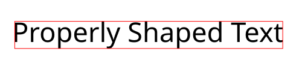

# Blend2d Shaping

High quality shaping for Blend2D with HarfBuzz.

```c++
#include <blend2d.h>
#include "blend2d_shaping.h"

auto render_text(BLContext& ctx, const char* filename) -> void {
    using namespace blend2d_shaping;

    const auto face = create_face_from_file(filename);
    const auto font = create_font(face, 45.25);

    ctx.save();
    ctx.translate(BLPoint {20, 70});

    const auto hb_text = HBShapedText {"Properly Shaped Text", font.hb_font};
    ctx.fillGlyphRun(BLPoint {}, font.bl_font, 
                     hb_text.glyph_run(), BLRgba32(0xFF000000));
    ctx.strokeRect(hb_text.bounding_rect(), BLRgba32(0xFFFF0000));

    ctx.restore();
}
```



### Usage in CMake

Clone this library, [Blend2D](https://github.com/blend2d) and [HarfBuzz](https://github.com/harfbuzz/harfbuzz) in the same directory. So you have the following directory structure:

```
external/blend2d/
external/blend2d_shaping/
external/harfbuzz/
```

Then in your project you can simply add this project via include:

```cmake
include("${BLEND2D_SHAPING_DIR}/CMakeLists.txt")
```
